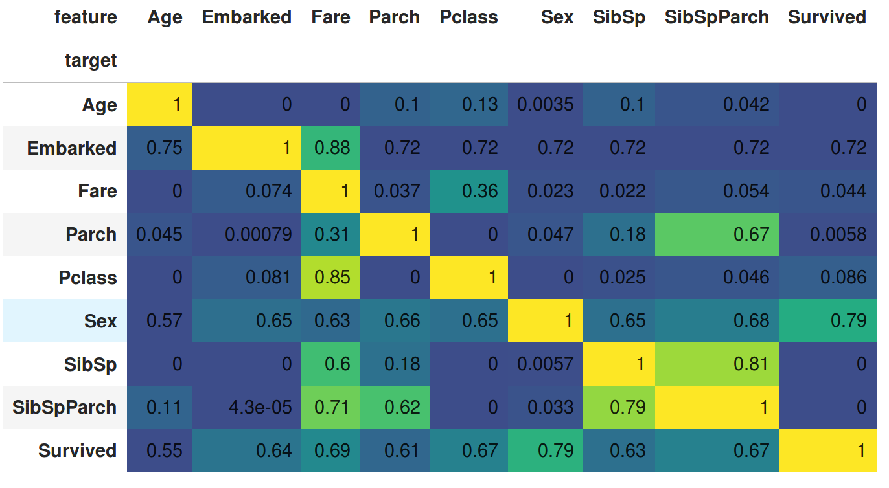

# discover_feature_relationships

Attempt to discover 1D relationships between all columns in a DataFrame using scikit-learn (RandomForests) and standard correlation tests (Pearson, Spearman and Kendall via Pandas). 

The goal is to see if we can better understand the data in a DataFrame by learning which features (1 column at a time) predict each other column. This code attempts to learn a predictive relationship between the Cartesian product (all pairs) of all columns.

Rather than just learning which column(s) predict a target column, we might want to know what other relationships exist (e.g. during Exploratory Data Analysis) and whether some predictive features are driven by other less-predictive features (to help us find new & better features or data sources). We might also sense-check out data by checking that certain relationships exist.

By default it assumes every target column is a regression challenge. You can provide a list of columns to treat as classification challenges. For regression we cap negative scores at 0 (r^2 can be arbitrarily negative, we cap at 0 to make this a little easier to interpret). 

Text-encoded columns are automatically LabelEncoded (this is a sensible default but may not reveal information in your case, you might need to provide your own smarter encoding). This adds to the correlation plots in YellowBrick and Pandas Profiling where the text columns are not auto-encoded.

We might want to use this tool alongside:

* https://github.com/ResidentMario/missingno
* https://github.com/pandas-profiling/pandas-profiling

The project (and the examples) live on GitHub:

* https://github.com/ianozsvald/discover_feature_relationships

## Titanic example

[Titanic Notebook](./example_titanic_discover_feature_relationships.ipynb)

* Embarked (classification) is predicted well by Fare, also by Age
* Pclass (regression) is predicted by Fare but Fare (regression) is poorly predicted by Pclass
* Sex (classification) is predicted well by Survived
* Survived (classification) is predicted well by Sex, Fare, Pclass, SibSpParch
  * Predicting this feature at circa 0.62 is equivalent to "no information" as 0.62 is the mean of Survived
* SibSpParch is predicted by both SibSp and Parch (SibSpParch is the sum of both - it is an engineered additional feature) - it is also predicted by Fare
* SibSp and Parch are also predicted by Fare (but less well so than by SibSpParch)



This is generated using:
```
df = pd.read_csv("titanic_train.csv")
...

import discover
df_results = discover.discover(cols, classifier_overrides, df)

df_results.pivot(index='target', columns='feature', values='score').fillna(1) \
.style.background_gradient(cmap="viridis", low=0.3, high=0.0, axis=1) \
.set_precision(2)
```

## Boston example

[Boston Notebook](./example_boston_discover_feature_relationships.ipynb)

* NOX predicts AGE and DIS (but not the other way around)
* target predicts LSTAT, LSTAT weakly predicts target, LSTAT weakly predicts RM
* DIS predicts AGE, AGE weakly predicts DIS
* INDUS predicts CRIM and somewhat AGE, B
* target weakly predicts RM, RM weakly predicts target

# Requirements

* python 3.6+
* scikit-learn (0.19+)
* pandas
* jupyter notebook
* matplotlib
* seaborn

```
conda install scikit-learn pandas jupyter pytest seaborn
conda install -c conda-forge watermark
```

# Setup

## Install from PyPI

`pip install discover_feature_relationships`

https://pypi.org/project/discover-feature-relationships/

## Install from source

First check-out from GitHub, then install with ```python setup.py install```, then `cd` into the `examples` folder and run the Notebooks.


# Tests

* Run `discover.py` for a simple test that the code is working 
* Run `pytest` to run `test_discover.py` for a single unit test (use `pytest -s` to see `print` outputs)

# Note to Ian for Development

Environment: `. ~/anaconda3/bin/activate discover_feature_relationships`

## Installer

To push to PyPI I need to follow https://docs.python.org/3/distributing/index.html#distributing-index - specifically `python se
tup.py sdist bdist_wheel` and `twine upload dist/*`. This uses https://pypi.org/project/twine/ .

## TODO

* consider version info: https://github.com/pallets/flask/blob/master/setup.py
* consider python_requires line in setup
* consider adding dependencies
* add dependencies to setup
* clean up the list of links
* bump version nbr
* add conda installer

